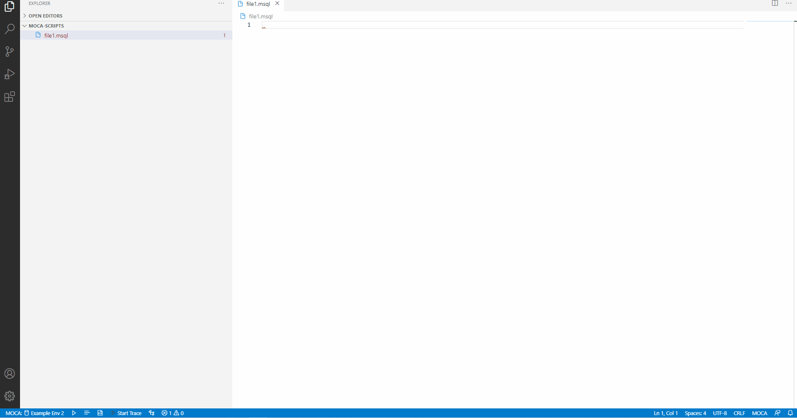

# MOCA Client Extension for Visual Studio Code

Provides MOCA client and language support for Visual Studio Code via the [MOCA Language Server].


## Quick Start
1. Install extension


2. Make sure [minimum Java version] is installed and either:
    - set [JRE_HOME] environment variable
    - set [JAVA_HOME] environment variable
    - set javapath in PATH environment variable

3. Extension is activated after you either:
    - open MOCA file (.moca **OR** .msql)
        - no difference between .moca and .msql -- just 2 extensions for the same thing
    - make MOCA connection


## Features


- Syntax highlighting
- [Intellisense]
- [Command Execution]
- [Trace Outliner]



## Commands
- `MOCA:Connect to MOCA Server`: Connect to 1 of the MOCA servers specified in `moca.connections` configuration.
- `MOCA:Load MOCA Cache`: Loads MOCA cache(commands/triggers/tables/views/etc).
- `MOCA:Execute MOCA Script` (`Ctrl+Enter`): Executes script in focused MOCA file and displays results in web view.
- `MOCA:Execute MOCA Selection` (`Ctrl+Shift+Enter`): Executes selection in focused MOCA file and displays results in web view.
- `MOCA:Execute MOCA Script To CSV` (`Ctrl+Alt+Enter`): Executes script in focused MOCA file and writes results to CSV file in same directory as MOCA script file.
- `MOCA:Execute MOCA Selection To CSV` (`Ctrl+Shift+Alt+Enter`): Executes selection in focused MOCA file and writes results to CSV file in same directory as MOCA script file.
- `MOCA:Execute MOCA Script With CSV`: Executes script in focused MOCA file with user selected CSV file parsed into `publish data` script as prefix and displays results in web view.
- `MOCA:Execute MOCA Script With CSV To CSV`: Executes script in focused MOCA file with user selected CSV file parsed into `publish data` script as prefix and writes results to CSV file in same directory as MOCA script file.
- `MOCA:Show MOCA Script Execution History For Current Window`: Shows MOCA script execution history for current window and allows user to insert into focused editor tab.
- `MOCA:MOCA Trace`: Starts/stops trace.
- `MOCA:Open MOCA Trace Outline`: Open MOCA trace outline(remote or local).
- `MOCA:Lookup MOCA Command`: Dialog appears for searching commands/triggers.
- `MOCA:Auto Execute MOCA Script`: Auto MOCA script execution.


*MOCA Connection | Execute | Execute Selection | Execute To CSV | Execute Selection To CSV | Show MOCA Script Execution History For Current Window | Command Lookup | Start/Stop Trace | Open Trace Outline*

## Settings

*can hover over configuration items below in vscode settings.json for more information*

- `moca.connections`: Array object that stores MOCA connection information.
```json
"moca.connections": [
    {
        "name": "MOCA Connection Name",
        "url": "http://connectionstring/service",
        "user": "USER",
        "password": "PASSWORD",
        "groovyclasspath": [
            "path\\to\\jar\\folder\\*",
            "path\\to\\jar\\folder\\file.jar"
        ],
        "approveUnsafeScripts": true
    }
]
```

*can remove/leave empty `user` and/or `password` fields in order to be prompted for them upon MOCA connection attempt*

- `moca.trace`: Trace options.
```json
"moca.trace": {
        "fileName": "DGLASS",
        "mode": "w"
    }
```
- `moca.autoExecution`: Auto MOCA script execution configuration.
```json
"moca.autoExecution": {
        "initialDuration": 2,
        "sleepDuration": 3,
        "stopIfExecutionCountExceeds": 10,
        "stopIfTimeElapses": 600,
        "stopIfExecutionError": true
    }
```
- `moca.clientOptions`: vscode extension configuration options.
```json
"moca.clientOptions": {
        "sqlRangeColorLight": "rgba(0,150,225,0.15)",
        "sqlRangeColorDark": "rgba(0,80,180,0.25)",
        "groovyRangeColorLight": "rgba(225,100,0,0.15)",
        "groovyRangeColorDark": "rgba(175,45,0,0.25)",
        "dataTablePageSize": 100,
        "showAllIconsInStatusBar": true
    }
```
- `moca.languageServerOptions`: [MOCA Language Server] configuration options.
```json
"moca.languageServerOptions": {
        "moca-diagnostics-enabled": true,
        "moca-warning-diagnostics-enabled": true,
        "sql-diagnostics-enabled": true,
        "sql-warning-diagnostics-enabled": true,
        "groovy-diagnostics-enabled": true,
        "groovy-warning-diagnostics-enabled": true,
        "sql-formatting-enabled": true,
        "groovy-formatting-enabled": true,
        "groovy-static-type-checking-enabled": true
    }
```
- `moca.defaultGroovyclasspath`: Additional entries to add to the classpath. May contain both folders and individual .jar files. This configuration can be overriden by groovyclasspath specified in MOCA connection.
```json
"moca.defaultGroovyclasspath": [
    "path\\to\\jar\\folder\\*",
    "path\\to\\jar\\folder\\file.jar"
]
```
- `moca.traceOutliner`: MOCA Trace Outliner Configuration
```json
"moca.traceOutliner": {
	"useLogicalIndentStrategy": true,
	"minimumExecutionTime": 1.000
}
```

## Contribute

If you think something is missing or could be improved, please open issues and pull requests. 

Please refer to the [contribution guide] for specifics.


## FAQ
Please refer to [FAQ] to see if questions have already been asked/answered!


## Contact

- Danny Glass - mrglassdanny@gmail.com


[MOCA Language Server]: https://github.com/mrglassdanny/moca-language-server
[FAQ]: https://github.com/mrglassdanny/vscode-moca-client/blob/master/FAQ.md
[minimum Java version]: https://github.com/mrglassdanny/moca-language-server
[JAVA_HOME]: https://confluence.atlassian.com/doc/setting-the-java_home-variable-in-windows-8895.html
[JRE_HOME]: https://confluence.atlassian.com/doc/setting-the-java_home-variable-in-windows-8895.html
[Intellisense]: https://github.com/mrglassdanny/moca-language-server
[Command Execution]: https://github.com/mrglassdanny/moca-language-server
[Trace Outliner]: https://github.com/mrglassdanny/moca-language-server
[contribution guide]: https://github.com/mrglassdanny/vscode-moca-client/blob/master/CONTRIBUTE.md